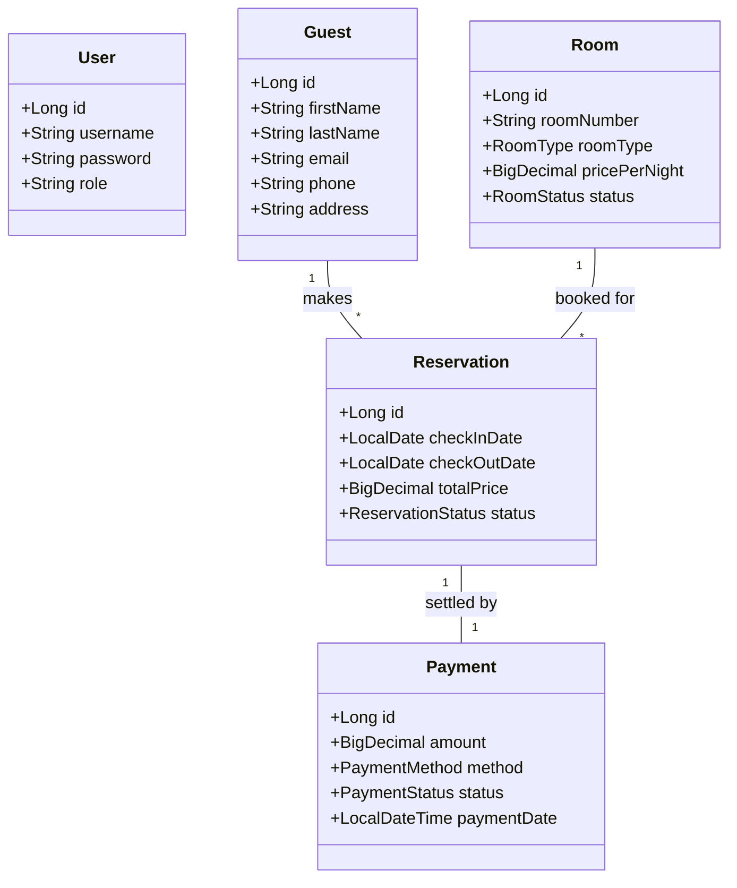
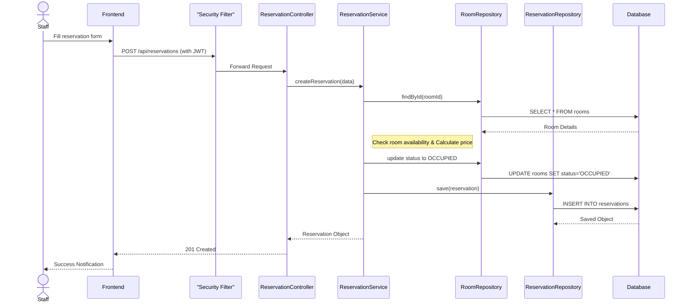

# UML Diagrams - Ocean View Resort Management System

This document provides the UML diagrams representing the design and architecture of the Ocean View Resort Reservation System, as required by Task A.

## 1. Use Case Diagram

The system involves two primary actors: **Staff (Operator)** and **Guest** (whose information is managed by the system).

```mermaid
useCaseDiagram
    actor Staff as "Hotel staff / Operator"
    
    package "Guest Reservation System" {
        usecase UC1 as "User Authentication (Login/Signup)"
        usecase UC2 as "Register New Guest"
        usecase UC3 as "Add New Reservation"
        usecase UC4 as "Search/Display Reservation"
        usecase UC5 as "Calculate & Print Bill"
        usecase UC6 as "Manage Room Status"
        usecase UC7 as "Access help section"
    }

    Staff --> UC1
    Staff --> UC2
    Staff --> UC3
    Staff --> UC4
    Staff --> UC5
    Staff --> UC6
    Staff --> UC7
```

### Design Decisions
*   **Centralized Staff Access:** All administrative tasks are restricted to authenticated staff to ensure security and prevent unauthorized bookings.
*   **Automatic Room Management:** Room status is updated automatically during the reservation/cancellation lifecycle to avoid manual errors.

---

## 2. Class Diagram

The class diagram below showcases the core entities and their relationships.



### Design Decisions
*   **Normalization:** Separated `Guest` and `User`. `User` represents system operators, while `Guest` represents the customers staying at the hotel.
*   **Enums for Status:** Used Enums (`RoomStatus`, `ReservationStatus`, `PaymentStatus`) to restrict input to valid states and improve code readability.

---

## 3. Sequence Diagram (Add New Reservation)

This diagram illustrates the flow of adding a new reservation.



### Design Decisions
*   **Service Layer Pattern:** Business logic (like price calculation and availability checks) is encapsulated in the `ReservationService` to keep controllers thin and reusable.
*   **JWT Authentication:** Every request is filtered through a security layer to verify the staff's session before processing data.
